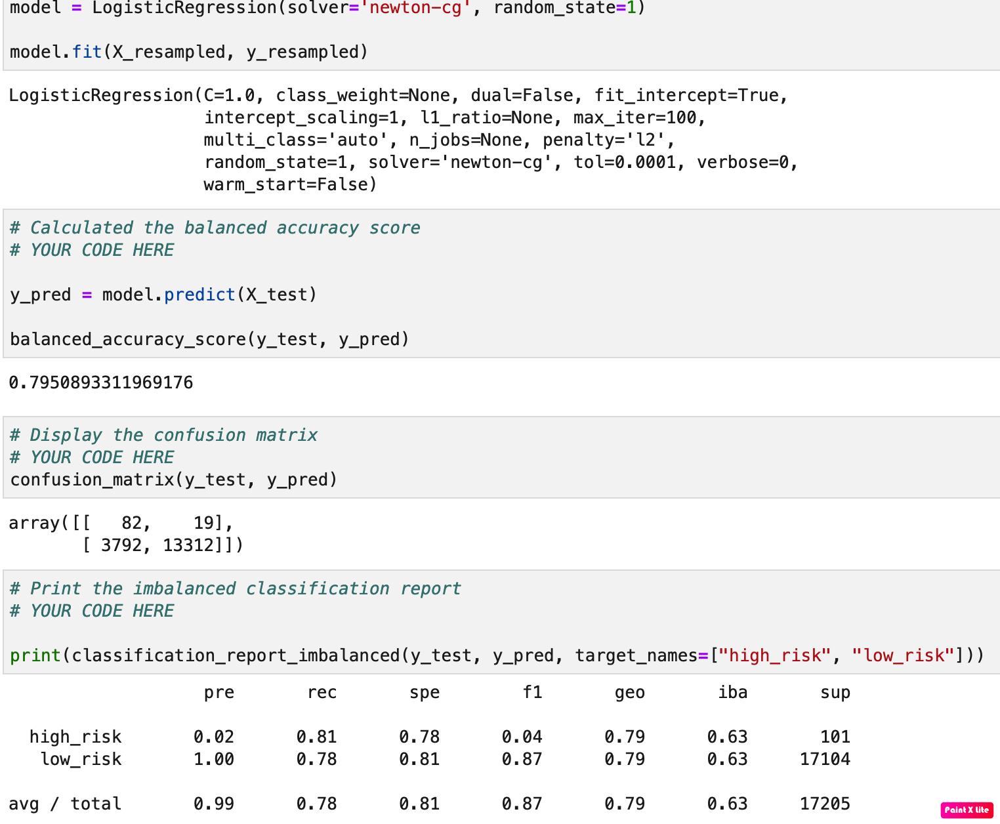
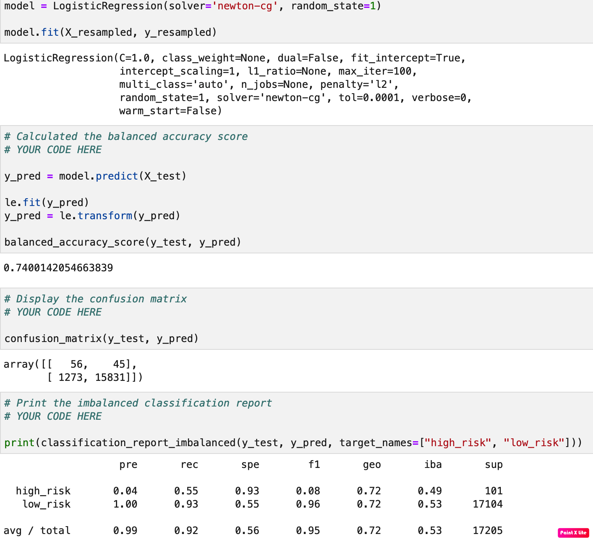
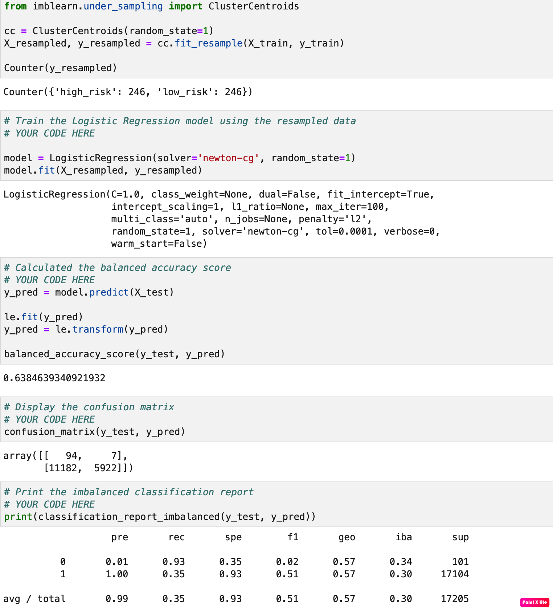
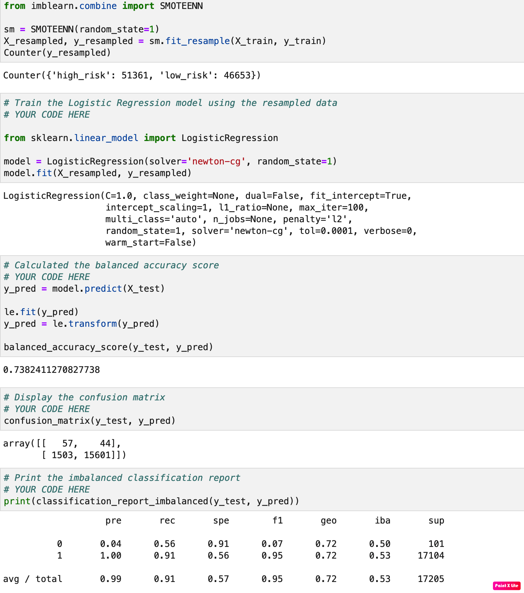
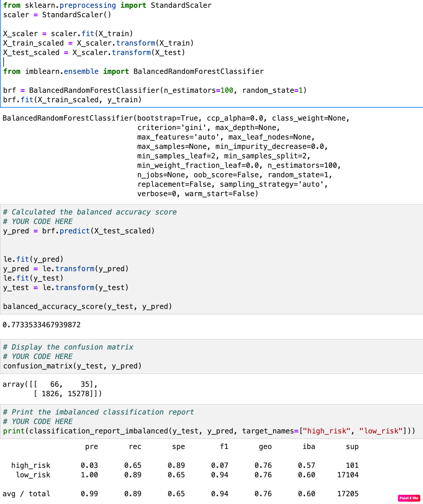
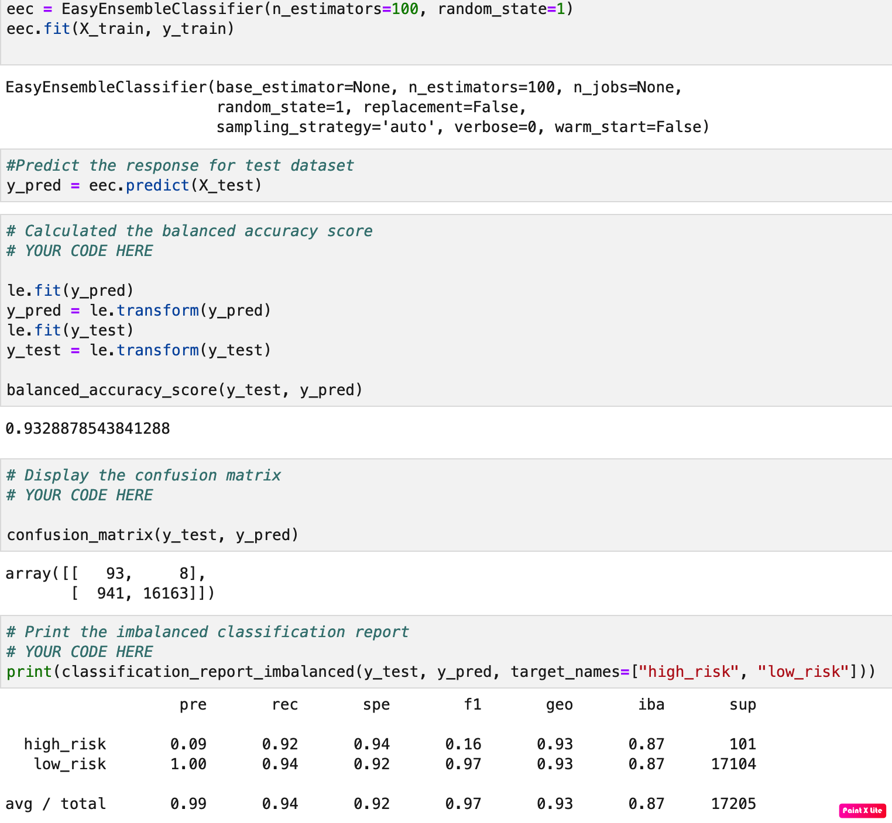

# Credit Risk Prediction

The idea of this assignment is to predict credit risk by using machine learning techniques applied over data samples extracted from LendinClub.

By building and evaluating several machine-learning models to predict credit risk, the main idea is to use the imbalanced-learn and Scikit-learn libraries using the two following techniques:

    1. Resampling/Undersamplin
    2. Ensemble Learning
    
---

## Resampling/Undersampling

[Resampling Starter Notebook](Starter_Code/credit_risk_resampling.ipynb)

Here is the process done within the code:

1. Read the CSV File with the data and perform the needed clean up
2. Split the data between Training and Testing
3. Build the models and evaluate the results:

## Resampling

### Naive Random Oversampling

---

### SMOTE Oversampling

---

## Undersampling

### ClusterCentroids

---

## Combination (Over and Under) Sampling

### SMOTEENN

---

## Conclusions

> Which model had the best balanced accuracy score?
> ** Naive Random OverSampling: 0.795089
>
> Which model had the best recall score?
> ** SMOTE: 0.92
>
> Which model had the best geometric mean score?
> ** Naive Random OverSampling: 0.79

---

## Ensemble Learning

[Ensemble Starter Notebook](Starter_Code/credit_risk_ensemble.ipynb)

Here is the process done within the code:

1. Read the CSV File with the data and perform the needed clean up
2. Split the data between Training and Testing
3. Build the models and evaluate the results:

### Balanced Random Forest Classifier

---

### Easy Ensemble AdaBoost Classifier

---

## Conclusions

> Which model had the best balanced accuracy score?
>
> Which model had the best recall score?
>
> Which model had the best geometric mean score?
>
> What are the top three features?

---
